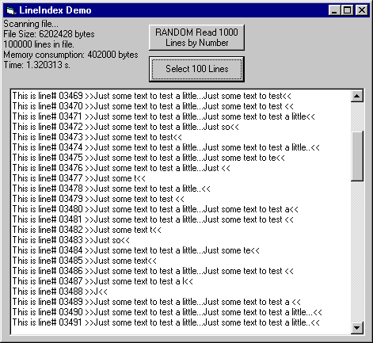



## LineIndex Class

### Description

Ever needed to read the 23553th Line from a 5MB file? This class will do that, *without* storing the file in an array! Very fast binary file access to read one or more line(s) by *line number*. Now you can read files page by page - backward.
 
### More Info
 
The class works with ansi text files.

The demo project creates (and deletes) a 6MB test file.

             |
---                |---
**Submitted On**   |2002-01-27 03:36:14
**By**             |[Martijn B](https://github.com/Planet-Source-Code/PSCIndex/blob/master/ByAuthor/martijn-b.md)
**Level**          |Advanced
**User Rating**    |4.6 (23 globes from 5 users)
**Compatibility**  |VB 6\.0
**Category**       |[VB function enhancement](https://github.com/Planet-Source-Code/PSCIndex/blob/master/ByCategory/vb-function-enhancement__1-25.md)
**World**          |[Visual Basic](https://github.com/Planet-Source-Code/PSCIndex/blob/master/ByWorld/visual-basic.md)
**Archive File**   |[LineIndex\_512871262002\.zip](https://github.com/Planet-Source-Code/martijn-b-lineindex-class__1-31235/archive/master.zip)

